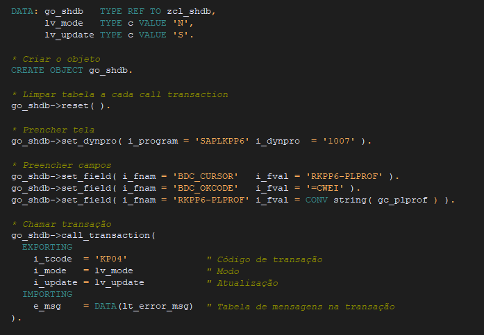

# shdb-call-transaction
 Classe para criar BDC e chamar transação genérica
 
 Com a utilização da classe não é necessário declarar a tabela BDC e fica mais fácil a visualização do preenchimento do mapeamento do SHDB.
 
 Para utilizar é só importar a classe no SAP via abapgit e utilizar conforme exemplo de uso.

## Exemplo de uso

